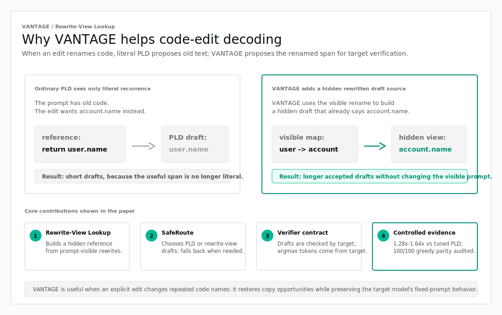
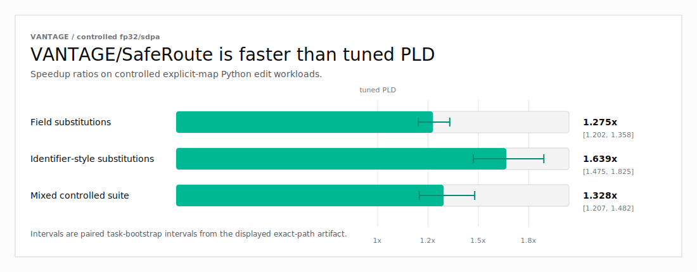
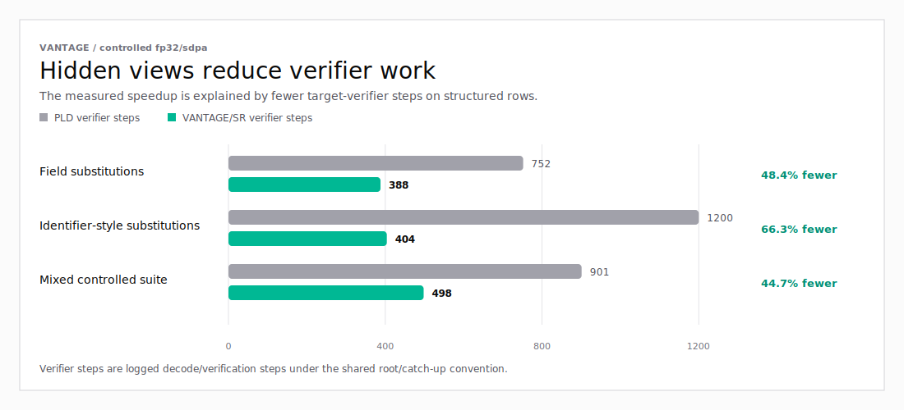

# VANTAGE: Hidden Rewrite Views for Fixed-Prompt Speculative Code-Edit Decoding

This repository contains the paper source, decoder implementation, locked
controlled manifests, tests, and reproduction utilities for **VANTAGE**.

VANTAGE is a research prototype for accelerating copy-heavy code-edit decoding
without changing the prompt seen by the target language model. The paper studies
a narrow mechanism: when a prompt explicitly says something like "rename `user`
to `account`", the system can build a hidden rewritten view of the reference
code and use that view only to propose speculative draft tokens. The target
model still decides what is emitted under the original prompt.

The diagram below summarizes the specific PLD failure mode VANTAGE targets, the
hidden rewrite-view draft source it adds, and the safeguards validated in the
paper.

<p align="center">
  
</p>

## Motivation and Mechanism

Prompt lookup decoding (PLD) is a model-free acceleration technique. It looks
for text that has already appeared in the prompt and proposes likely
continuations by copying from that prompt. This works well when the output
reuses the prompt literally.

Code edits often break literal reuse. If the reference code contains `user`, but
the requested edit consistently wants `account`, literal PLD keeps seeing the
old text and misses long copy spans in the desired output.

VANTAGE addresses that specific failure mode:

1. Read an explicit rewrite instruction from the prompt, such as
   `rename user to account`.
2. Apply that rewrite to the prompt-visible reference code to form a hidden
   transformed reference.
3. Tokenize and index the hidden reference as a speculative draft source.
4. Let **SafeRoute** choose between ordinary PLD and the rewrite-view candidate.
5. Verify every emitted draft token with the target model, or emit target
   argmax correction/bonus tokens directly from the target model.

The hidden rewrite view is never appended to the visible prompt. It can only
change which draft tokens are proposed for verification, not the target model's
prompt-conditioned greedy function.

<p align="center">
  
</p>

## Validated Claim

The validated claim is deliberately limited.

On Qwen2.5-Coder-7B controlled explicit-map Python edit workloads,
VANTAGE/SafeRoute accelerates tuned PLD on the audited fp32/sdpa path while
preserving vanilla greedy output on audited fp32 paths.

Headline controlled results reported in the paper:

| Workload | VANTAGE/SafeRoute vs tuned PLD |
|---|---:|
| Field substitutions | 1.28x |
| Identifier-style substitutions | 1.64x |
| Mixed controlled suite | 1.33x |

The charts below visualize the same artifact-derived numbers reported in the
paper. They can be regenerated with
[`scripts/generate_readme_charts.py`](scripts/generate_readme_charts.py).

<p align="center">
  
</p>

<p align="center">
  
</p>

In the audited headline workloads, PLD and VANTAGE/SafeRoute both match vanilla
greedy output on 100/100 prompts.

The result is best read as a mechanism study: deterministic hidden views can
recover speculative copy opportunities that literal PLD misses, while the
target model remains the emission authority.

## Scope Boundaries

This repository should not be read as evidence for:

- production-serving readiness;
- broad real-world code-edit acceleration;
- broad edit-quality improvement;
- multi-model universality;
- stochastic sampling preservation;
- bf16 exactness;
- superiority over public production serving stacks;
- validated real-commit transfer for the preliminary ViewBank variants.

The bf16, prompt-injection, instruction-model, route-margin, and real-commit
ViewBank results are diagnostics unless the paper explicitly labels them
otherwise.

## Naming

- **VANTAGE**: the public method/system name.
- **Rewrite-View Lookup**: the core primitive that builds the hidden transformed
  reference view.
- **SafeRoute**: the prompt-time router used in the validated decoder.
- **VANTAGE/SafeRoute** or **VANTAGE/SR**: the evaluated validated method.
- **ViewBank prototype**: broader preliminary multi-view experiments used only
  for diagnostic artifact terminology.

Some repository-relative artifact paths, method tags, and schemas still contain
`transpld`, the old internal name for Rewrite-View Lookup. Those tags are
preserved only because generated artifacts and table scripts refer to them.
They are not the public method name.

## Repository Layout

```text
paper/                         LaTeX source and compiled PDF snapshot
asts/                          Decoder, proposer, routing, and evaluation code
vantage_vllm/                  Patched vLLM prompt-lookup helpers
scripts/                       Manifest, audit, summarization, upload, and run helpers
tests/                         Unit and regression tests for core mechanisms
docs/                          Public artifact notes, claim ledger, rewrite extraction, and benchmark protocol
data/manifests_frozen_audit/   Small locked controlled manifests used by the paper
patches/                       vLLM patch notes and prototype fragments
third_party/                   Third-party patch/readme material
```

Useful entry points:

- [`paper/vantage.tex`](paper/vantage.tex): source of truth for the paper.
- [`paper/vantage.pdf`](paper/vantage.pdf): compiled PDF snapshot.
- [`docs/vantage_claim_ledger.md`](docs/vantage_claim_ledger.md): claim-to-evidence ledger.
- [`docs/artifact_release.md`](docs/artifact_release.md): artifact upload and restore plan.
- [`docs/vantage_rewrite_extraction.md`](docs/vantage_rewrite_extraction.md): rewrite extraction behavior.
- [`docs/vantage_real_edit_benchmark_protocol.md`](docs/vantage_real_edit_benchmark_protocol.md):
  future real-edit benchmark protocol.
- [`scripts/run_eagle_eval.py`](scripts/run_eagle_eval.py): main controlled-run harness.
- [`scripts/summarize_transpld_exact_path_success.py`](scripts/summarize_transpld_exact_path_success.py):
  summary generator for the exact-path headline artifact.

## Getting Started

Create a local environment:

```bash
git clone https://github.com/faizancodes/vantage-rewrite-views.git
cd vantage-rewrite-views
python3 -m venv .venv
source .venv/bin/activate
python3 -m pip install -U pip
python3 -m pip install -e ".[dev]"
```

For GPU evaluation and artifact scripts, install the evaluation extras:

```bash
python3 -m pip install -e ".[dev,eval]"
```

The full model-timing runs require GPU access, Qwen2.5-Coder-7B model access,
and the same backend settings described in the paper. The small locked manifests
are included locally; large generated artifacts are not bundled in Git.

## Build The Paper

If `latexmk` is available:

```bash
latexmk -pdf -interaction=nonstopmode -halt-on-error paper/vantage.tex
```

Fallback with `pdflatex`:

```bash
cd paper
pdflatex -interaction=nonstopmode -halt-on-error vantage.tex
pdflatex -interaction=nonstopmode -halt-on-error vantage.tex
```

An arXiv source-bundle helper is available:

```bash
scripts/make_arxiv_bundle.sh paper/vantage.tex vantage_arxiv_source.tar.gz
```

## Run Local Checks

Core import and unit-test checks:

```bash
python3 -m compileall -q asts vantage_vllm scripts
python3 -m pytest tests/test_vantage_policy.py \
  tests/test_code_proposers.py \
  tests/test_vantage_vllm_proposer.py \
  tests/test_patched_vllm_pld_equivalence.py \
  tests/test_pld_lookup.py -q
```

Additional tests are available under [`tests/`](tests/). Some evaluation tests
and scripts require GPU/model access or external artifacts.

## Artifacts And Data

The GitHub repository is source-focused. It includes the small locked manifests
needed to inspect the controlled workloads, but large generated outputs should
be restored from the Hugging Face dataset:

<https://huggingface.co/datasets/faizancodes/vantage-artifacts>

The dataset preserves repository-relative paths, using VANTAGE-facing artifact
roots such as `artifacts/vantage_transpld/`,
`artifacts/vantage_viewbank/`, and `artifacts/vantage_residual/`. The remaining
`transpld` tag is a historical run/artifact tag for Rewrite-View Lookup; it is
not the public method name.

Restore large artifacts into a clone:

```bash
python3 scripts/download_vantage_artifacts.py \
  --repo-id faizancodes/vantage-artifacts \
  --local-dir .
```

The upload helper remains available for maintainers who need to refresh the
dataset from a full local research tree with the VANTAGE-facing artifact roots
listed in [`docs/artifact_release.md`](docs/artifact_release.md). It accepts a
write-capable Hugging Face token from `HF_TOKEN`, `HUGGINGFACE_HUB_TOKEN`, or
an existing `hf auth login` session, and a dataset id in `VANTAGE_HF_DATASET`.

Dry-run the upload plan:

```bash
export VANTAGE_HF_DATASET="your-username-or-org/vantage-artifacts"
python3 scripts/upload_vantage_data_to_hf.py \
  --source-root /path/to/full/research/tree \
  --repo-id "$VANTAGE_HF_DATASET" \
  --dry-run
```

## Reproducibility Notes

- The paper's primary evidence uses locked controlled manifests under
  [`data/manifests_frozen_audit/`](data/manifests_frozen_audit/).
- The audited headline backend is fp32/sdpa on Qwen/Qwen2.5-Coder-7B.
- The paper separates task-bootstrap confidence intervals from run-to-run timing
  variance.
- bf16 paths are timing diagnostics and are not used as exactness evidence.
- Prompt injection is a changed-prompt baseline, not fixed-prompt equivalence.
- Deterministic rewriting is a task-solver sanity check, not the decoder
  contribution.

## Citation

Citation metadata is in [`arxiv_metadata.txt`](arxiv_metadata.txt). A BibTeX
entry should be added after the arXiv identifier is available.

## License

No open-source license file has been added yet. Add an explicit license before
treating this repository as reusable open-source software.
